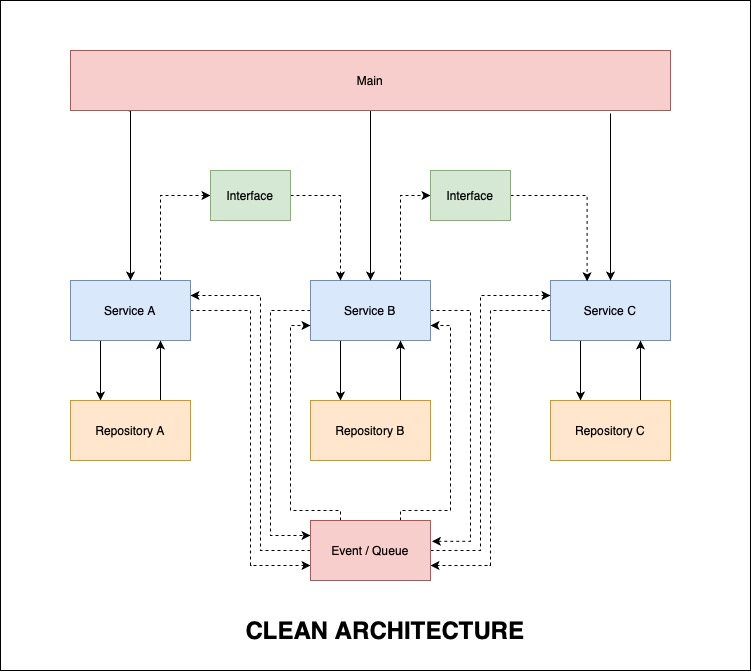

# NODEJS ARCHITECTURE WITH SOLID PRINCIPLES 

## Running
### 1. Install Package
- npm install
- npm install -D @types/express @types/mongoose

### 2. Testing
npm run test

### 3. Run in development mode
npm run dev

### 4. Build
npm run build

### 5. Run in production mode
npm run start

## Architecture

<p align="center">
  
</p>

<p align="center">
  
</p>

## FLOW

Table
```
User
Task: User do task
Activity: Logging user action from event
```

Guide: update soon at https://mysolution.dev 