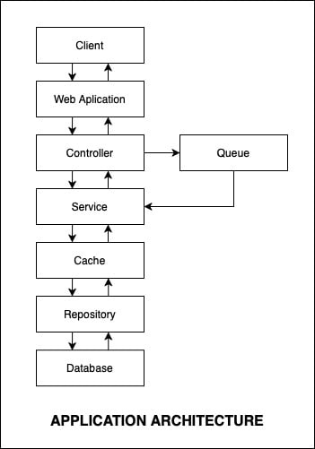

# NODEJS ARCHITECTURE WITH SOLID PRINCIPLES 

## Running
### 1. Testing
npm run test

### 2. Run in development mode
npm run dev

### 3. Build
npm run build

### 4. Run in production mode
npm run start

## Architecture


## FLOW

Table
```
User
Task: User do task
Activity: Logging user action from event
```

Guide: update soon at https://mysolution.dev 